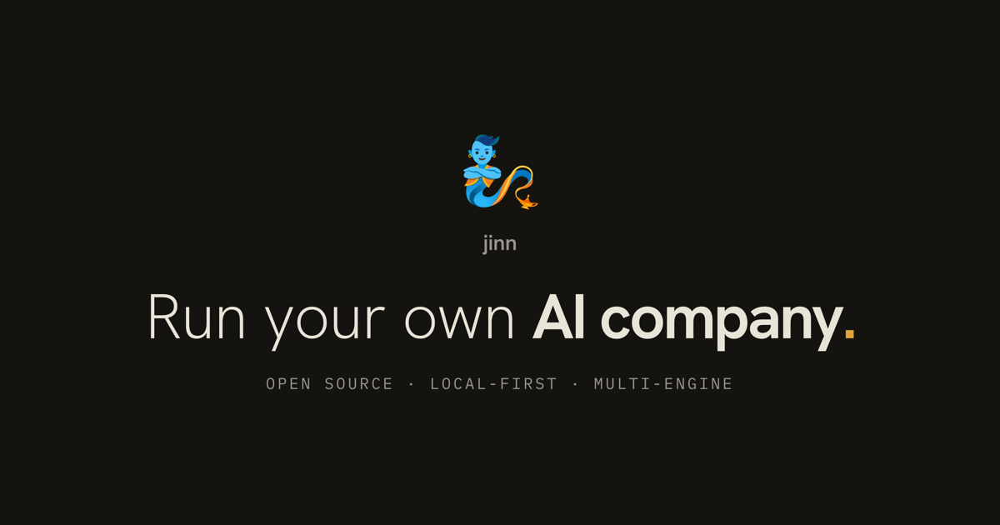

<h1 align="center">🧞 jinn.run</h1>

<p align="center"><strong>The open-source website and documentation for Jinn.</strong></p>

<p align="center">
  <a href="https://jinn.run">Live website</a> ·
  <a href="https://jinn.run/docs/">Documentation</a> ·
  <a href="https://github.com/hristo2612/jinn">Jinn source</a> ·
  <a href="https://www.npmjs.com/package/jinn-cli">npm</a>
</p>



This repository contains the public presentation layer for [Jinn](https://github.com/hristo2612/jinn), the local-first gateway for running AI agents as a company. It includes the marketing site, product feature stories, human documentation, and machine-readable integration guides.

The Jinn gateway and dashboard live in the separate [Jinn product repository](https://github.com/hristo2612/jinn).

## What is included

- The animated landing page at [`jinn.run`](https://jinn.run)
- The product feature deck at [`/features/`](https://jinn.run/features/)
- Starlight documentation at [`/docs/`](https://jinn.run/docs/)
- The agent integration guide at [`/agents.md`](https://jinn.run/agents.md)
- The model discovery index at [`/llms.txt`](https://jinn.run/llms.txt)
- Contract tests that execute documented requests against a real isolated Jinn gateway
- Accessibility, browser, visual regression, link, privacy, and Lighthouse gates

## Stack

- [Astro](https://astro.build/) for the static site
- [Starlight](https://starlight.astro.build/) for documentation
- TypeScript and GSAP for progressively enhanced product scenes
- Vitest, Playwright, axe-core, and Lighthouse CI for verification
- A checked-in snapshot of Jinn's public Ledger design tokens

All meaningful content is rendered to static HTML. JavaScript enhances the product scenes, but the site remains readable with JavaScript disabled and respects reduced-motion preferences.

## Local development

Requirements:

- Node.js 24
- pnpm 10.6.4

```bash
git clone https://github.com/hristo2612/jinn-landing.git
cd jinn-landing
pnpm install --frozen-lockfile
pnpm dev
```

Astro prints the local URL when the server starts.

### Useful commands

```bash
pnpm dev              # local development server
pnpm build            # static production build in dist/
pnpm preview          # serve the production build with exact route MIME types
pnpm typecheck        # Astro and TypeScript checks
pnpm lint             # ESLint and Prettier verification
pnpm test             # unit tests
pnpm test:e2e         # browser and accessibility tests
pnpm test:visual      # approved visual regression matrix
pnpm test:lighthouse  # mobile performance budgets
pnpm safety:check     # privacy and credential scan
```

## Product-truth contracts

The website does not invent API behavior. Public documentation is pinned to an exact Jinn release target in `src/data/release.json`, and `pnpm docs:contract` verifies request and response shapes against an isolated gateway built from that target.

For the full release gate, place a checkout of the Jinn product repository next to this repository and set both source variables:

```bash
git clone https://github.com/hristo2612/jinn.git ../jinn
export JINN_SOURCE_ROOT="$(cd ../jinn && pwd)"
export JINN_SOURCE_REPO="$JINN_SOURCE_ROOT"
pnpm check
```

`pnpm check` verifies Ledger token provenance, types, formatting, unit tests, the production build, public safety, internal links, and the documentation contract.

## Deploying to Vercel

The site is a static Astro project and requires no server adapter or environment variables.

1. Import `hristo2612/jinn-landing` into Vercel.
2. Keep `main` as the production branch.
3. Vercel detects Astro automatically.
4. The checked-in `vercel.json` fixes the build command to `pnpm build`, the output directory to `dist`, and the required security and machine-route headers.
5. Attach `jinn.run` only when the selected Jinn release and website release gate are both green.

Vercel uses the repository's Node 24 engine range, pnpm lockfile, and pinned `packageManager` version.

## Contributing

Read [CONTRIBUTING.md](CONTRIBUTING.md) before opening a change. Documentation accuracy, accessibility, privacy, and reduced-motion behavior are release requirements, not optional polish.

Security issues should follow [SECURITY.md](SECURITY.md) and should never be filed with credentials or private gateway data in a public issue.

## License and brand

The website source is available under the [MIT License](LICENSE). The Jinn name, logo, and official brand assets are not granted for use in a way that implies an unofficial project is endorsed by Jinn. See [BRAND.md](BRAND.md).
